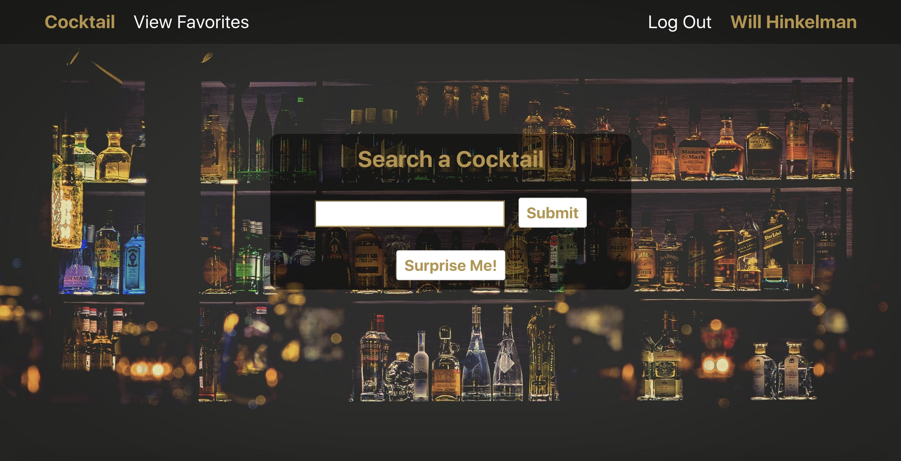
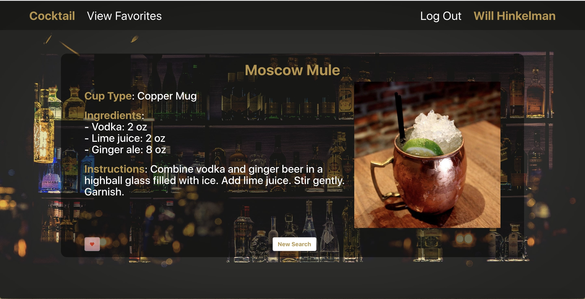

# Cocktail

### Cocktail is a website that allows one to search for any cocktail and find out its ingredients and recipe. Users can then save the cocktails they like.

## 

## Technologies Used
- HTML
- CSS
- JavaScript
- Express.js
- Node.js
- React
- MongoDB
- Mongoose

## Getting Started
- New users will be asked to Signup for an account.
- You can then search for any cocktail!

[Go To Cocktail](https://cocktail-finder2020.herokuapp.com/)

## Next Steps
#### In the future I plan to add a 'Random' button that will output any coktail. Also I would like to implement a Bar (chatroom) using socket.io

